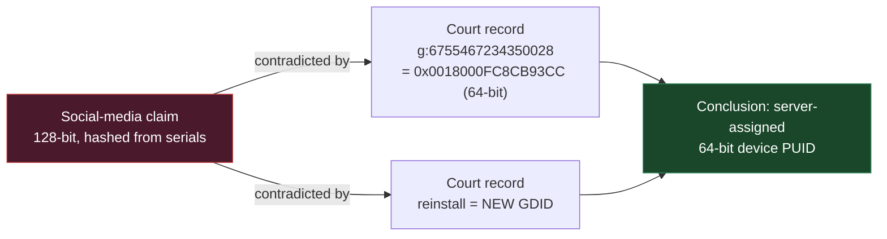
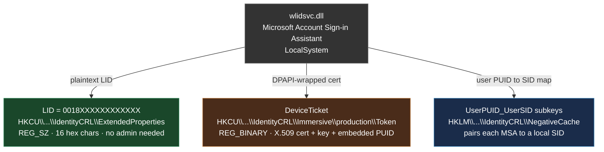
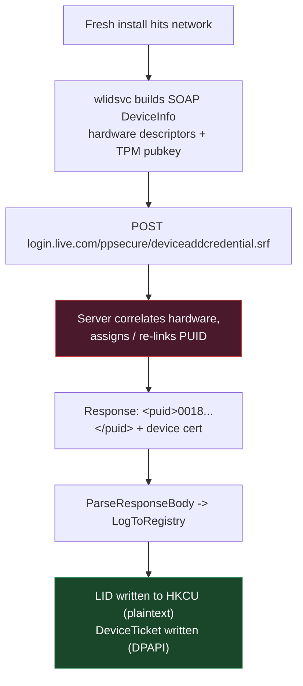
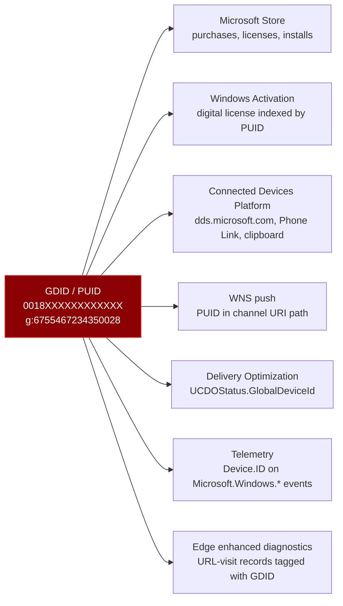
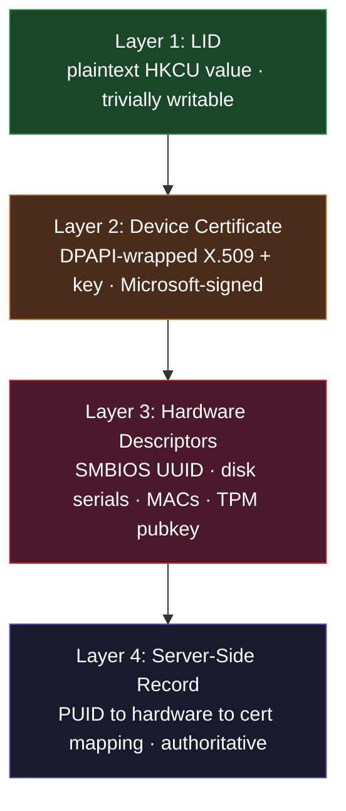
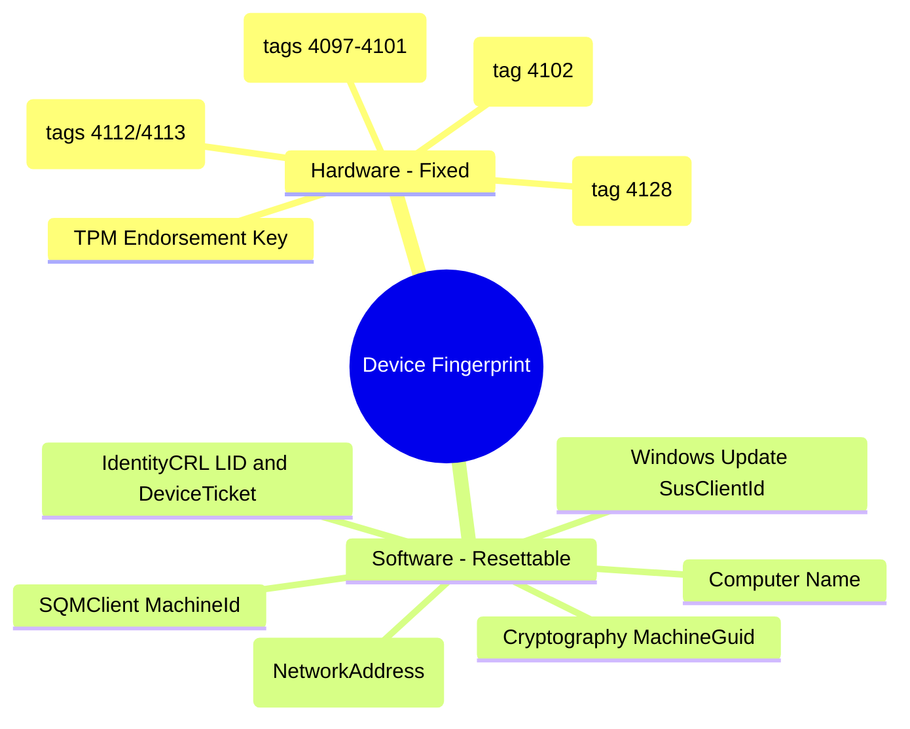
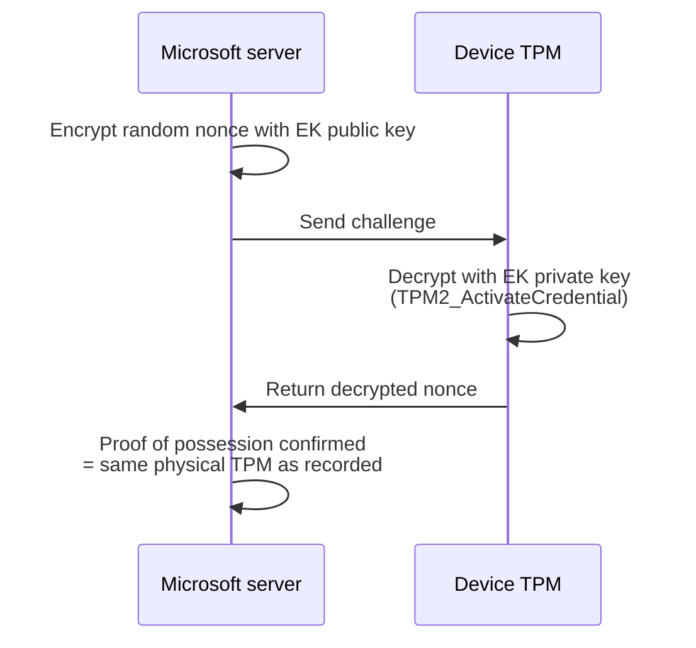
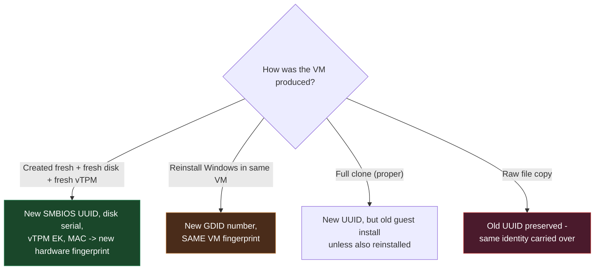
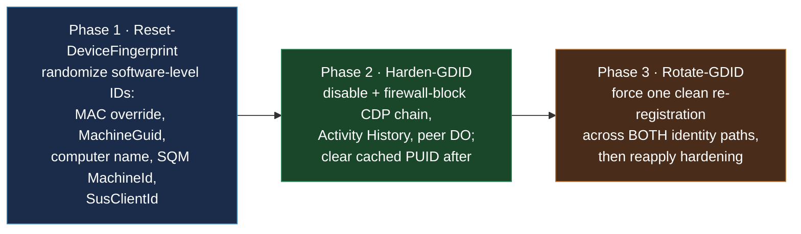
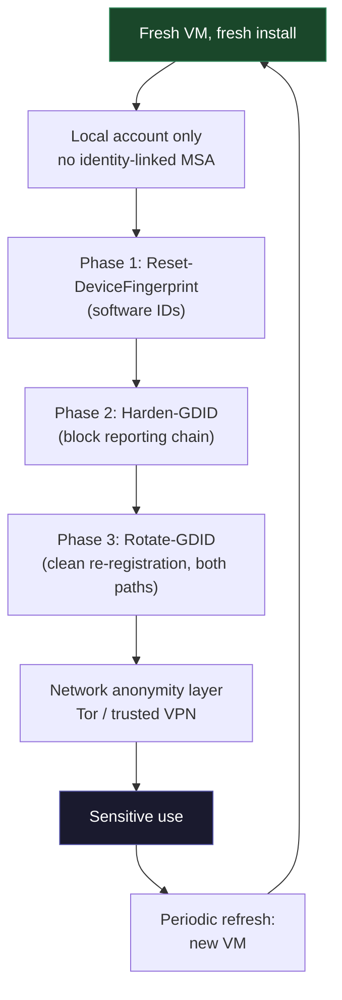

<div align=center>

# Windows Global Device Identifier (GDID) - Extensive Research
<br/>

## Intro
Consolidated technical reference covering the persistent Windows device identifier named in the July 2026 `United States v. Stokes` complaint. Written for defensive practitioners hardening at-risk Windows endpoints where switching operating systems is not an option. Combines three public research sources with independent reproduction and script-based testing.

**Target Environment:** Windows 10 / Windows 11 both VM and not.

</div>

<br/>
<br/>

## Scope and Intent
This document is a defensive security research for educational use. It describes how a documented Windows telemetry/identity mechanism works so that defenders can measure their exposure and reduce it. It does not describe or provide device-impersonation tooling, credential extraction for presenting one machine as another, or any technique whose primary purpose is to defeat lawful attribution of a different person's device. Where source material included such tooling, it is referenced only as out of scope.

**Reason of the research**: in the past weeks i got interested in the case, but the documents i found online did not completely satisfied my curiosity. This research aims to unify and expand the knowledge and testing of the topic.

<br/>
<br/>

## Quick links
- [Windows Global Device Identifier (GDID) - Extensive Research](#windows-global-device-identifier-gdid---extensive-research)
  - [Intro](#intro)
  - [Scope and Intent](#scope-and-intent)
  - [Quick links](#quick-links)
  - [Confidence Labelling](#confidence-labelling)
  - [1. Executive Summary](#1-executive-summary)
  - [2. What the Court Record Established](#2-what-the-court-record-established)
  - [3. What the GDID Actually Is](#3-what-the-gdid-actually-is)
  - [4. Where it Lives on Disk](#4-where-it-lives-on-disk)
  - [5. How Microsoft Issues It](#5-how-microsoft-issues-it)
  - [6. The Two Registration Paths](#6-the-two-registration-paths)
  - [7. Where it Surfaces across Microsoft Services](#7-where-it-surfaces-across-microsoft-services)
  - [7a. The Connected Devices Platform and DDS](#7a-the-connected-devices-platform-and-dds)
    - [DDS Endpoints](#dds-endpoints)
    - [7a.1 Captured Live Registration Handshake](#7a1-captured-live-registration-handshake)
  - [8. The Four-Layer Identity Model](#8-the-four-layer-identity-model)
  - [9. The Hardware Descriptor Set](#9-the-hardware-descriptor-set)
  - [9a. Hardware vs Software Fingerprints](#9a-hardware-vs-software-fingerprints)
  - [10. The TPM Endorsement Key: the hard floor](#10-the-tpm-endorsement-key-the-hard-floor)
  - [11. Mitigation Analysis](#11-mitigation-analysis)
  - [12. Virtual Machine Considerations](#12-virtual-machine-considerations)
  - [13. A Layered Hardening Toolkit (our testing)](#13-a-layered-hardening-toolkit-our-testing)
  - [14. Recommended Operational Posture](#14-recommended-operational-posture)
  - [15. Limitations and Caveats](#15-limitations-and-caveats)
  - [16. Source Appendix](#16-source-appendix)
    - [Primary Source](#primary-source)
    - [Public Research Consolidated in this document](#public-research-consolidated-in-this-document)
    - [Independent Corroboration](#independent-corroboration)
    - [Our Contribution](#our-contribution)

<br/>
<br/>

## Confidence Labelling
Every substantive claim in this document is tagged so each can be weighed independently:

- `[COURT]` - stated in the the US federal criminal complaint.
- `[STATIC]` - provable from Windows binaries, public symbols/PDBs, or Microsoft's own documentation.
- `[OBSERVED]` - reproduced on a live test machine or VM during this research.
- `[COMMUNITY]` - reported by community reverse-engineering, corroborated where possible but not independently disassembly-verified.
- `[ASSESSED]` - reasoned inference from the combined evidence, not a directly observed fact.

Where two independent sources agree on a point, that is noted explicitly, because independent corroboration is what separates a reliable finding from a repeated assumption.

<br/>
<br/>

---

## 1. Executive Summary

The GDID is a **64-bit device PUID** (Passport Unique Identifier) that Microsoft's identity servers assign to a Windows installation when it first registers over the network. `[STATIC][COURT]` It is stored locally in plaintext, transmitted alongside a set of hardware descriptors and a TPM-backed device certificate, and surfaces across most Microsoft online services (Store, activation, Connected Devices Platform, push notifications, Delivery Optimization, telemetry, and Edge diagnostics).

Three facts define the entire mitigation problem:

1. **The number is server-assigned, not locally computed.** `[STATIC]` A reinstall or a forced re-registration produces a new local number.
2. **The binding is server-side.** `[COURT][ASSESSED]` Microsoft's backend correlates the new number to the same physical machine using the hardware descriptors and TPM attestation submitted during registration.
3. **The TPM endorsement key is the cryptographic anchor.** `[STATIC][COMMUNITY]` It cannot be extracted or spoofed on the original hardware, which is why rotating the local identifier does not sever server-side linkage.

The practical consequence: **software-only hardening reduces which identifiers are exposed and how often, but it cannot make a physical machine unlinkable to itself.** On reusable hardware the only robust reset is new hardware; in virtualized environments, a genuinely new VM is the equivalent of new hardware.

<br/>
<br/>

---

## 2. What the Court Record Established

`[COURT]` A federal criminal complaint in _United States v. Peter Stokes_, No. 25 CR 812 (N.D. Ill., Eastern Div.), describes how Microsoft assisted attribution of activity to a specific Windows installation. The superseding complaint was sworn by FBI Special Agent Ali Sadiq on **April 16, 2026** (the initial complaint was signed December 22, 2025) and was **unsealed on or about June 30 to July 1, 2026** following Stokes's arrest in Finland and extradition to Chicago. At **¶ 25** the affidavit introduces the identifier as `Global Device Identifier g:6755467234350028` ("the GDID") and records a Microsoft representative describing it as a persistent, device-level identifier designed to uniquely identify an installation of a Windows operating system on a device, either a physical device (e.g. a phone or laptop) or a virtual machine, across certain Microsoft services. The primary source document is the DOJ-published superseding complaint ([justice.gov PDF](https://www.justice.gov/usao-ndil/media/1450651/dl)); see also the DOJ press release ([justice.gov](https://www.justice.gov/opa/pr/alleged-member-criminal-cyber-hacking-group-scattered-spider-arrested-finland-and-extradited)).

**The Court Case:** Stokes, 19, a dual U.S.-Estonian citizen, is charged as an alleged member of the "Scattered Spider" / "Octo Tempest" group (18 U.S.C. §§ 371, 1030, 1343, 1349). The GDID surfaces in the affidavit's Company F intrusion narrative (¶¶25 to 30): Microsoft records tied `g:6755467234350028` to the ngrok signup that created the account used in the intrusion, and to a series of URL visits and IP addresses that the affiant then correlated to Stokes's other accounts. Note that the affidavit attributes the URL-visit/browsing evidence to "Microsoft records" generally; it does **not** name Edge enhanced diagnostics (or any specific telemetry surface) as the collection mechanism. The Edge-diagnostics attribution elsewhere in this document is therefore `[ASSESSED]`/`[COMMUNITY]` inference, not a `[COURT]` fact.

Two structural facts are load-bearing for the rest of this document:

- The value has the form `g:` followed by a decimal integer. `6755467234350028` in hexadecimal is `0x0018000FC8CB93CC` - a 64-bit value in the `0x0018` (device) namespace.
- The record states that a reinstall of Windows yields a new GDID, which rules out the value being a pure function of unchanging hardware serials.

A widely circulated social-media summary claiming the GDID is "128-bit and generated from serial numbers on install" is contradicted on both points by the primary source: the value fits in 64 bits, and a reinstall changes it.



<br/>
<br/>

---

## 3. What the GDID Actually Is

`[STATIC]` Inside Microsoft's own code the value is a PUID (Passport Unique Identifier), a name inherited from .NET Passport, which became Microsoft Account. The public-facing `PassportIdentity.HexPUID` member in the legacy `System.Web.Security` documentation reflects the same lineage. The consumer Windows device PUID mechanism has existed since Windows Vista.

`[STATIC][OBSERVED]` The first two bytes of the value are a namespace tag:

|Prefix|Meaning|
|---|---|
|`0x0018`|Device PUID (one per Windows installation)|
|`0x0003`|User PUID (one per Microsoft Account)|

So a single installation carries one device GDID (`0018...`), and each Microsoft Account signed in on that installation carries its own user PUID (`0003...`). The court exhibit (`0018000FC8CB93CC`) sits in the device namespace, consistent with values reproduced on our test systems.

<br/>
<br/>

---

## 4. Where it Lives on Disk

`[STATIC][OBSERVED]` The identity is managed by `wlidsvc` (the Microsoft Account Sign-in Assistant, `C:\Windows\System32\wlidsvc.dll`, hosted under `svchost.exe -k netsvcs` as LocalSystem). It writes the identity to three registry locations:



**The primary copy is plaintext.** `[OBSERVED]` `HKCU\SOFTWARE\Microsoft\IdentityCRL\ExtendedProperties\LID` is a 16-hex-character `REG_SZ` readable by any process running as that user - no elevation required. This is the value that a one-line registry read returns and the one on which everything else depends.

**The device certificate is the enforcement layer.** `[STATIC][COMMUNITY]` `...\Immersive\production\Token\{AppContainerSID}\DeviceTicket` holds a DPAPI-wrapped blob containing the X.509 device certificate (with the PUID embedded) that `wlidsvc` uses to prove the device's identity to Microsoft. This is why a naive edit of the plaintext LID alone does not hold (see [§8](#8-the-four-layer-identity-model)).

**The `NegativeCache` subkeys** pair user PUIDs to local SIDs and are relevant to multi-user forensic analysis.

`[STATIC]` String analysis of `wlidsvc.dll` exposes the class hierarchy behind this, including `DeviceIdStore::LoadFromRegistry`, `DeviceIdStore::LogToRegistry`, `CDeviceIdentityBase::CreateNewDeviceIdentity`, `CDeviceIdentityBase::BindDeviceToHardware`, `CDeviceIdentityBase::GetDeviceCert`, and `CAssociateDeviceRequest::ParseResponseBody`. The retained source path `onecoreuap\ds\ext\live\identity\ntservice\lib\svccommon\deviceidstore.cpp` appears in the binary.

The presence of `BindDeviceToHardware` as a first-class operation is itself significant: hardware binding is an explicit design goal of the subsystem, not an incidental side effect.

<br/>
<br/>

---

## 5. How Microsoft Issues It

`[STATIC][COMMUNITY]` On first network contact, `wlidsvc` issues an HTTP POST to `https://login.live.com/ppsecure/deviceaddcredential.srf` requesting a device identity. The request body is a SOAP envelope containing a `<DeviceInfo>` block of `<Component>` tags - each a hardware descriptor with a numeric name - plus a TPM public key.

The server performs an undisclosed correlation/assignment step and returns a SOAP response carrying the assigned PUID:

```xml
<DeviceAddResponse Success="true">
    <success>true</success>
    <puid>0018XXXXXXXXXXXX</puid>
    <DeviceTpmKeyState>0</DeviceTpmKeyState>
    <License>...</License>
</DeviceAddResponse>
```

`[STATIC]` The client parses that `<puid>` via `CAssociateDeviceRequest::ParseResponseBody`, calls `DeviceIdStore::LogToRegistry`, and writes the hex to `...\ExtendedProperties\LID`.



`[ASSESSED]` The critical property: the **client never computes the identifier**. The server decides whether a given set of hardware descriptors represents a device it has seen before. This is the mechanism by which the same hardware resolves to a linkable identity regardless of how many times the local number is reset.

<br/>
<br/>

---

## 6. The Two Registration Paths

`[COMMUNITY][OBSERVED]` A point missed by early single-source analysis but corroborated across sources and confirmed in our own testing: there are two registration paths, and hardening only the user path leaves a gap.

||Per-user / MSA path|System / anonymous path|
|---|---|---|
|**Hive**|`HKCU\...\IdentityCRL`|`HKEY_USERS\.DEFAULT\...\IdentityCRL`|
|**Identity principal**|Signed-in user SID|LocalSystem (`S-1-5-18`)|
|**Trigger**|Microsoft Account sign-in|Automatic, post-install, no sign-in required|
|**Documented earliest**|Well documented|Flagged late; the "anonymous device path"|

`[ASSESSED]` The original public writeup's author appended a correction noting that a GDID exists even without an MSA sign-in, because the Connected Devices Platform has an anonymous device path. The community repo describes this same anonymous/system path independently. The practical implication for defenders: any tool that clears or rotates only the per-user hive will miss the system-context identity, which re-registers automatically. Our testing (see [§13](#13-a-layered-hardening-toolkit-our-testing)) addresses both paths deliberately.

`[OBSERVED]` **The OOBE bypass myth:** Using `OOBE\BYPASSNRO` to force a local account during Windows Setup prevents the creation of a User PUID, but it does **not** prevent the creation of a Device PUID (GDID) via the SYSTEM hive. The device will still register with the Device Directory Service regardless of whether a Microsoft Account was ever presented during setup.

<br/>
<br/>

---

## 7. Where it Surfaces across Microsoft Services

`[STATIC][COMMUNITY]` Once `wlidsvc` holds the PUID and device certificate, that pair is presented on Microsoft service calls the OS makes:



**Delivery Optimization** is the one place Microsoft names the value in public documentation: the `UCDOStatus` table exposes a `GlobalDeviceId` column, described as an identifier used by Microsoft internally, sitting alongside `ISP`, `City`, and `Country` - i.e. a device ID lined up with geo/network data. `[STATIC]`

**Connected Devices Platform** (`cdp.dll`, services `CDPSvc` / `CDPUserSvc`) reads the PUID via `GetStableDeviceIdFromProvider`, prepends `g:`, and registers it into the Device Directory Service graph at `dds.microsoft.com`. `[STATIC]` CDP consumes the identifier; it does not compute it. (See [§7a](#7a-the-connected-devices-platform-and-dds) for the full DDS subsystem breakdown.)

**Edge enhanced diagnostics** is the _assessed_ surface for the browsing-history evidence: the court record shows URL-visit records tied to the GDID (¶¶ 26 to 29, including the ngrok signup page, `[Company F].com`, and other hosts) but attributes them only to "Microsoft records," never to a named telemetry channel. Identifying Edge as the specific channel is community/assessed inference, not a court finding. `[COURT][COMMUNITY][ASSESSED]`

`[ASSESSED]` The breadth matters for defense: because the identifier rides along on many independent service channels, blocking any single channel is insufficient. Effective hardening must target the point of registration and the services collectively, not one endpoint.

<br/>
<br/>

---

## 7a. The Connected Devices Platform and DDS

`[STATIC]` `C:\Windows\System32\cdp.dll` (the Connected Devices Platform, services `CDPSvc` + `CDPUserSvc`) contains the `GlobalDeviceId` symbol and an entire **Device Directory Service** registration subsystem. The relevant internal source files and classes recovered from binary analysis:

```
Source files:
    ddsregistrationclient.cpp
    ddsregistrationmanager.cpp
    ddsregistrationinfo.cpp

Classes:
    DdsRegistrationClient
    RegisterUserDevicesObserver
    DdsRegistrationInfoProviderForCDP

Device-ID format string: "g:%s"
```

**DDS = Device Directory Service**, Microsoft's cross-device identity graph (the backend behind Phone Link, cloud clipboard, "Continue on PC", and Nearby Share). CDP is the Windows client that **registers the installation into that graph**, where it gets keyed as `g:<decimal>`.

<br/>

### DDS Endpoints

`[STATIC][OBSERVED]` The following endpoints are referenced within `cdp.dll` and observed in network captures during registration:

|Endpoint|Role|
|---|---|
|`dds.microsoft.com`|Primary DDS registration and graph sync|
|`fd.dds.microsoft.com`|Front-door / failover DDS endpoint|
|`aad.cs.dds.microsoft.com`|Azure AD / Entra ID credential service for DDS (enterprise device join path)|
|`cdpcs.access.microsoft.com`|CDP credential service / access token issuance for graph operations|

`[ASSESSED]` The presence of `aad.cs.dds.microsoft.com` confirms that DDS registration is not exclusively a consumer/MSA path; enterprise devices joined via Entra ID also register into the same graph, meaning that MDM-managed devices carry the same GDID surface even under organizational management.

<br/>

### 7a.1 Captured Live Registration Handshake

`[OBSERVED]` Forcing a fresh registration (restart `CDPSvc` with its local state cleared) and capturing CDP's own ETW providers produced the whole handshake:

```text
DdsClient::RegisterUserDeviceAsync()
    RegistrationReason: Startup
    Account Type: MSA

DDSClient: Registration response received. HTTP status code: 200

OnRegisterUserDeviceComplete

GetDeviceIdAndTicketActivity -> deviceid: 0018XXXXXXXXXXXX
```

`[OBSERVED]` Key observations from the ETW trace:

- `RegistrationReason: Startup` confirms that CDP re-registers on every service start, not only on first install. This means that simply clearing the local PUID without blocking CDP results in immediate re-registration on the next boot.
- `GetDeviceIdAndTicketActivity` is the function that retrieves both the device ID and the DPAPI-wrapped ticket (certificate) as a paired unit, confirming that Layers 1 and 2 of the identity model ([§8](#8-the-four-layer-identity-model)) are retrieved and transmitted together.
- The `Account Type: MSA` field indicates this capture was on the per-user path; the anonymous/SYSTEM path ([§6](#6-the-two-registration-paths)) produces an equivalent trace with `Account Type: Anonymous`.

<br/>
<br/>

---

## 8. The Four-Layer Identity Model

`[COMMUNITY][OBSERVED]` The most useful analytical framing from the combined research is that Microsoft's device identity is four layers deep, and any attempt to alter it locally fails at whichever layer it first fails to satisfy:



`[COMMUNITY]` The source research documented a progression of local-modification experiments, each defeated at a predictable layer:

|Modification|Layers addressed|Local persistence|Server-side result|
|---|---|---|---|
|Overwrite the plaintext LID only|1|Minutes; `LoadFromRegistry` detects the mismatch and reverts|Rejected - cert still carries original PUID|
|LID + device certificate reuse|1-2|Until next `wlidsvc` network call|Rejected - hardware descriptors don't match|
|LID + cert + full hardware spoof|1-3|Holds locally|Blocked at TPM EK challenge (see [§10](#10-the-tpm-endorsement-key-the-hard-floor))|
|Clear IdentityCRL, re-register|resets 1-2|New PUID issued|Re-linked to same hardware server-side|

`[ASSESSED]` The unifying lesson: the local registry is a cache; the server-side record is the source of truth. You cannot correct the authoritative record by editing the cache. This is precisely why a legitimate defensive strategy focuses on reducing and refreshing what is submitted (and on not submitting under a linkable context in the first place) rather than on forging a different identity - the latter is both out of scope here and, per the evidence, technically defeated at the TPM layer anyway.

**Note on the last row:** the deeper impersonation experiments in the source material (certificate extraction under SYSTEM, DPAPI re-wrapping, and TPM challenge relaying to another physical machine) are out of scope for this defensive writeup. They are described in the source only as unresolved engineering problems with open questions about server behavior, and they aim at presenting one machine as a different specific device - outside the defensive purpose here.

<br/>
<br/>

---

## 9. The Hardware Descriptor Set

`[COMMUNITY]` The `<Component>` tags submitted during registration use the same numeric descriptor set that Windows Autopilot uses for its hardware hash. This is independently corroborated: the tag numbering below was cross-checked against Rudy Ooms' 2022 Autopilot hardware-hash reverse-engineering (`oofhours.com`) - an unrelated source, four years earlier, analyzing a different subsystem - and the numbering matches, including which values remain unexplained.

|Tag|Descriptor|Corroboration|
|---|---|---|
|4097, 4098|System / board manufacturer|Autopilot RE (2022) + GDID research (2026)|
|4099|Product / model name|Both|
|4100|Version / board version|Both|
|4101|SMBIOS system serial|Both|
|4102|SMBIOS UUID|Both|
|4112, 4113|Disk serial numbers|GDID research|
|4128|MAC address|GDID research; Autopilot uses permanent MAC via `OID_802_3_PERMANENT_ADDRESS`|
|4130|Network adapter bus name|GDID research|
|4144|32-byte value (undocumented; possibly a thumbprint or SHA-256)|Both flag as unexplained|
|8195, 8196, 8197|Undocumented|Both flag as unexplained, 2022 and 2026|
|TPMInfo|TPM public key material|Both|

`[ASSESSED]` Two independent teams arriving at the same tag map four years apart, on two different Windows subsystems, strongly supports the conclusion that GDID device registration reuses the Autopilot/OA3 hardware-hashing code path. That in turn tells defenders exactly which local attributes feed the fingerprint - and which of them are changeable.

A crucial distinction for mitigation planning: Autopilot documentation specifies that the MAC descriptor is the permanent (burned-in) address, and the disk serial is read at the hardware query layer. On physical hardware these are fixed. In a VM they are hypervisor-assigned and therefore malleable (see [§12](#12-virtual-machine-considerations)).

<br/>
<br/>

---

## 9a. Hardware vs Software Fingerprints

`[STATIC][OBSERVED]` To effectively plan mitigation, one must understand the boundary between what software can alter and what is physically burned into the silicon. The following categorization consolidates all identifiers relevant to the GDID registration and telemetry chain:



`[ASSESSED]` Our mitigation framework ([§13](#13-a-layered-hardening-toolkit-our-testing)) focuses entirely on the "Software - Resettable" category to ensure that when a new GDID is requested, the software-level telemetry does not immediately re-associate the device with its previous state. The hardware-fixed category cannot be altered from within the guest OS on physical machines; only VM re-provisioning or physical hardware replacement addresses those anchors.

<br/>
<br/>

---

## 10. The TPM Endorsement Key: the hard floor

`[STATIC][COMMUNITY]` The reason local rotation cannot sever server-side linkage is the TPM Endorsement Key (EK) attestation. The EK is a key pair burned into the TPM at manufacture. The public half is readable by any process (`NCryptGetProperty` with `NCRYPT_PCP_EKPUB_PROPERTY`); the private half is generated inside the chip and never leaves it.



`[ASSESSED]` This is a standard, legitimate attestation pattern - the same class of mechanism used by Device Health Attestation and Windows Hello for Business TPM-bound credentials - which is part of why the claim is credible rather than speculative. Its consequence for de-linking is decisive:

- A different machine (or a VM with its own vTPM) has a different EK key pair and cannot answer a challenge encrypted for the original EK.
- Injecting the original machine's EK public key elsewhere does not help, because the corresponding private key required to answer the challenge remains in the original silicon.
- Therefore, on the original physical hardware, the TPM EK is a stable anchor that a new GDID number is bound back to.

`[ASSESSED]` The defensive reading is not "defeat the TPM" - it is "the TPM guarantees a physical machine is linkable to itself, so genuine unlinkability requires a genuinely different TPM," i.e. different hardware or a different virtual machine with its own vTPM.

<br/>
<br/>

---

## 11. Mitigation Analysis

`[OBSERVED][ASSESSED]` Combining the source mitigation tables with our own testing yields the following honest assessment. "Effective" here means reduces or severs Microsoft-side correlation, not merely changes a local value.

| Action                                       | What it breaks                     | Local effect                   | Severs server-side linkage?                  | Usability impact                                                   |
| -------------------------------------------- | ---------------------------------- | ------------------------------ | -------------------------------------------- | ------------------------------------------------------------------ |
| Overwrite LID in registry                    | Nothing                            | Self-reverts in minutes        | No                                           | None                                                               |
| Disable `wlidsvc`                            | Store, activation, UWP, CDP, WNS   | Stops registration while off   | Yes, until any MSA sign-in re-triggers it    | Breaks Store, Xbox, Phone Link, OneDrive sync                      |
| Firewall / block `login.live.com`            | Same as disabling `wlidsvc`        | Blocks registration round-trip | Yes, while blocked                           | Same as above                                                      |
| Disable CDP (`CDPSvc` / `CDPUserSvc`)        | Phone Link, cross-device clipboard | Stops DDS graph registration   | Partial - stops the CDP surface specifically | Breaks Phone Link, cloud clipboard, Nearby Share, "Continue on PC" |
| Clear IdentityCRL + re-register              | Nothing                            | New PUID on disk               | No - re-linked to same hardware              | Temporary re-authentication prompts                                |
| Reinstall Windows (same hardware)            | Clean slate                        | New PUID, new cert             | No - same hardware re-binds                  | Full setup cost                                                    |
| New/replaced hardware, or a genuinely new VM | Cost / setup effort                | New everything                 | Yes - new SMBIOS UUID, serials, MACs, TPM EK | Full functionality maintained on new platform                      |

`[ASSESSED]` The through-line, agreed across all three sources and our testing: every purely-local action is either cosmetic or temporary; the only robust reset is a genuinely different hardware fingerprint. For a physical endpoint that cannot be replaced, the realistic goal is exposure reduction - minimizing which services transmit the identifier and refusing to register under an identity-linked context - rather than unlinkability, which physical hardware cannot provide against a server-side correlator.

This is where defensive value is genuinely achievable:

1. **Prevent the identity-linked registration in the first place.** A device that never signs into an MSA tied to the protected person's real identity, and whose registration traffic is blocked or routed anonymously, never contributes a linkable `MSA <-> hardware` record for that person.
2. **Reduce the surface.** Disabling CDP, Activity History, peer Delivery Optimization, and optional diagnostics removes several of the channels on which the identifier and associated activity/geo data are transmitted.
3. **Refresh on a genuinely new fingerprint.** When the platform is a VM, periodically provisioning a new VM resets the hardware-level anchors that a reinstall alone cannot.

<br/>
<br/>

---

## 12. Virtual Machine Considerations

`[OBSERVED]` A VM changes the calculus significantly, because everything the source research calls "fixed hardware" is, in a VM, hypervisor-generated configuration rather than physical silicon.

|Identifier|Physical machine|Virtual machine|
|---|---|---|
|SMBIOS UUID (4102)|Firmware-fixed|Hypervisor-assigned; regenerated on genuinely new VM|
|Disk serial (4112/4113)|Firmware-fixed|Hypervisor-assigned|
|MAC (4128)|Burned-in|Hypervisor-assigned; always changeable|
|TPM EK|Silicon, immutable|vTPM EK generated when the vTPM is added to that VM|

`[OBSERVED]` The decisive behavioral finding, confirmed in testing on a VirtualBox-on-Debian setup:

- **A genuinely new VM** (created fresh, with a fresh virtual disk and a freshly added vTPM) generates new values across all of the above. This is the virtual equivalent of new hardware, and it is sufficient to obtain a GDID that is not hardware-linked to the previous VM.
- **Reinstalling Windows inside the same VM** does not reset the VM-level identifiers. The SMBIOS UUID, virtual disk serial, and vTPM EK belong to the VM's configuration, not to the guest install. A reinstall changes the GDID number but resubmits the same VM fingerprint.
- **Cloning or manually copying VM files** silently preserves the original identifiers unless a proper "full clone" (which regenerates the UUID) is used. A raw file copy is the classic way to accidentally keep the old identity.



`[ASSESSED]` For a defender who can operate the protected workload inside a VM, this is the most practical control available: treat each sensitive context as a fresh VM. It sidesteps the physical-hardware floor entirely, because a fresh VM has a genuinely different virtual TPM and firmware identity. Host-side reset of individual VM identifiers is possible for a reusable-VM workflow, but a from-scratch VM is simpler and less error-prone.

<br/>
<br/>

---

## 13. A Layered Hardening Toolkit (our testing)

`[OBSERVED]` To validate the analysis above, we built and tested a set of PowerShell tools, each addressing a distinct layer. The full scripts are maintained separately; only representative snippets are included here. The design principle throughout is audit-first, reversible, and explicit about what it cannot cover.

**Reading the local identifier (unprivileged, three lines):**

```powershell
$lid  = (Get-ItemProperty 'HKCU:\SOFTWARE\Microsoft\IdentityCRL\ExtendedProperties' -Name LID).LID
$puid = [Convert]::ToUInt64($lid, 16)
"GDID : g:$puid"
```

Auditing the full local fingerprint surface (device PUID, neighbouring `MachineGuid`/`SQM MachineId`, SMBIOS tags, TPM EK public hash, disk serials, MACs) into a timestamped JSON record enables before/after diffing across VM re-provisioning. In testing this made it straightforward to confirm that a fresh VM produced a genuinely different fingerprint, and that an in-place reinstall did not.

**The three-stage hardening sequence we settled on, in order:**



**Key design decisions validated in testing:**

- **Order matters.** Clearing the cached PUID before the services that write it are disabled simply causes immediate re-registration. The cache clear must follow the service disable.
- **Both registration paths must be handled.** Rotating only the per-user hive leaves the system/anonymous (`S-1-5-18`) identity intact, which re-registers on its own. The rotation stage addresses both.
- **Hardening and rotation conflict by design, so they must cooperate.** A forced re-registration needs the very services and network paths that hardening disables. The rotation tool detects the hardened state, lifts exactly what it needs for the round-trip, then re-locks - rather than silently failing against its own firewall rules.
- **Everything is reversible.** Each destructive step records prior state to a backup for restore, and supports a dry-run (`-WhatIf`) preview.

**Representative pattern - service-scoped firewall block** (more durable than hosts-file entries, since it holds regardless of which CDN IP the endpoint resolves to):

```powershell
New-NetFirewallRule -DisplayName "GDID-Hardening-Block-$svc" -Direction Outbound `
    -Action Block -Service $svc -Profile Any -Enabled True
```

**Defense-in-depth: hosts-file blocks.** `[OBSERVED]` In addition to service-scoped firewall rules, we add static hosts-file entries for known DDS endpoints as a secondary layer. This is less durable than firewall rules (it can be defeated by IP-literal connections or DNS-over-HTTPS bypass), but it provides a fallback if a service ignores the firewall scope or spawns an unscoped child process:

```
0.0.0.0 dds.microsoft.com
0.0.0.0 fd.dds.microsoft.com
0.0.0.0 aad.cs.dds.microsoft.com
0.0.0.0 cdpcs.access.microsoft.com
```

**Snippet: Generating a locally administered MAC override.** `[OBSERVED]` To prevent the OS-level MAC address from acting as a static identifier, we generate a randomized, locally administered unicast address. The second hex digit of the first octet must be restricted to `2, 6, A, or E` to comply with IEEE 802.3 standards for locally administered addresses:

```powershell
function New-RandomMacAddress {
    # Locally-administered, unicast: second hex digit of first octet in {2,6,A,E}
    # The first octet must be a FULL random byte (0-255) BEFORE the bits are forced.
    # Using -Maximum 16 restricts it to 0x00-0x0F, so after (-bor 0x02 -band 0xFE)
    # every generated address collapses to a static {02,06,0A,0E} prefix - a
    # fingerprintable constant, which defeats the control. -bor and -band are equal
    # precedence and left-associative in PowerShell, so parenthesize for clarity.
    $firstByte = ((Get-Random -Minimum 0 -Maximum 256) -bor 0x02) -band 0xFE
    $bytes = ,([Convert]::ToString($firstByte, 16).PadLeft(2,'0'))
    1..5 | ForEach-Object { $bytes += (Get-Random -Minimum 0 -Maximum 256).ToString('x2') }
    return ($bytes -join '')
}
```

**Snippet: Clearing the identity cache.** `[OBSERVED]` To force re-registration, the cached Device PUID and associated immersive tokens must be purged from the registry while the responsible services are halted:

```powershell
function Invoke-IdentityCacheClear {
    # Per-user path
    $lidPath = 'HKCU:\SOFTWARE\Microsoft\IdentityCRL\ExtendedProperties'
    if (Test-Path $lidPath) {
        Remove-ItemProperty -Path $lidPath -Name 'LID' -ErrorAction SilentlyContinue
    }
    $tokenRoot = 'HKCU:\SOFTWARE\Microsoft\IdentityCRL\Immersive\production\Token'
    if (Test-Path $tokenRoot) {
        Get-ChildItem -Path $tokenRoot -ErrorAction SilentlyContinue | ForEach-Object {
            Remove-ItemProperty -Path $_.PSPath -Name 'DeviceId' -ErrorAction SilentlyContinue
        }
    }
    # SYSTEM / anonymous path (requires SYSTEM context or psexec -s)
    $sysLidPath = 'Registry::HKEY_USERS\.DEFAULT\SOFTWARE\Microsoft\IdentityCRL\ExtendedProperties'
    if (Test-Path $sysLidPath) {
        Remove-ItemProperty -Path $sysLidPath -Name 'LID' -ErrorAction SilentlyContinue
    }
}
```

`[ASSESSED]` **What the toolkit does not do:** it does not alter SMBIOS UUID, TPM EK, or physical disk/NIC hardware serials (impossible from inside the guest); it does not make a physical machine unlinkable server-side; and it deliberately contains no certificate-extraction or impersonation capability. Its value is exposure reduction and clean, controlled refresh - not defeating attribution of the machine to itself.

<br/>
<br/>

---

## 14. Recommended Operational Posture

`[ASSESSED]` For the stated defensive use case - protecting at-risk individuals on Windows where the OS cannot be changed - the combined evidence supports this posture, strongest first:

1. **Dedicated VM per sensitive context, provisioned fresh.** A new VM is the cleanest available reset of the hardware-level anchors and sidesteps the TPM floor. Never clone or file-copy; always create fresh and install fresh.
2. **No identity linkage at provisioning.** The device should never register an MSA tied to the person's real identity. A local account plus the registration-blocking hardening prevents a linkable `MSA <-> hardware` record from being created. Note: `OOBE\BYPASSNRO` alone is insufficient - the SYSTEM-level anonymous registration still occurs ([§6](#6-the-two-registration-paths)).
3. **Network-level anonymity for the traffic that does egress.** Registration and telemetry that cannot be blocked should not traverse an attributable network path; Tor or a trusted VPN addresses the IP-correlation dimension that the identifier alone does not cover.
4. **Apply the hardening toolkit before any sensitive use, and re-apply after feature updates**, which are known to re-enable CDP/Activity History and revert policy values.
5. **Periodic refresh.** Because activity accumulates against whatever identity is current, rotating to a fresh VM on a schedule limits how much history any single identifier accumulates.
6. **Manage on managed fleets via policy, not local scripts.** On Entra/domain-joined devices, Group Policy or MDM (Intune) can silently overwrite local registry hardening upon the next policy refresh; the controls must be delivered as policy to persist. Local script-based hardening on a domain-joined machine is a temporary state that will revert.



<br/>
<br/>

---

## 15. Limitations and Caveats

`[ASSESSED]` In keeping with responsible defensive research, the boundaries of what this work establishes:

- **Some claims are community-observed, not disassembly-verified.** The two registration paths, the exact hardware descriptor payload, and the server-side re-linking behavior come from community reverse-engineering. Where independent corroboration exists (the Autopilot tag map, the court record's reinstall behavior), confidence is higher; where it does not (exact server correlation algorithm), the honest answer is that it is unobserved from outside Microsoft.
- **Server-side behavior is inferred, not seen.** No party outside Microsoft observes the correlation step directly. The conclusion that a new PUID re-links to the same hardware is a strong inference from the reinstall-behavior in the court record plus the hardware-submission mechanism - consistent, but not a captured server trace.
- **Mitigations degrade functionality.** Every effective control breaks Microsoft-dependent features (Store, activation, cross-device sync). This is a genuine trade-off, not a free win, and should be communicated to protected users.
- **MAC override instability.** `[OBSERVED]` Not all network interface card (NIC) drivers respect the `NetworkAddress` registry override. Forcing a MAC change on incompatible drivers will result in a loss of network connectivity or the adapter reverting to its burned-in address upon reboot. Testing on the specific target hardware is mandatory before relying on this control.
- **Domain and Entra ID overrides.** `[ASSESSED]` The mitigation scripts rely on local Group Policy and registry modifications. If a device is joined to an Active Directory domain or Entra ID (Azure AD), centralized Mobile Device Management (MDM) policies will silently overwrite local hardening settings upon the next policy refresh. On managed fleets, these controls must be delivered as MDM/GPO policy, not local scripts.
- **This is not anonymity.** Hardening one identifier chain does not address browser fingerprinting, network-level correlation, account-based linkage, or anything logged before hardening was applied. It is one layer of a defense-in-depth posture, not a solution on its own.
- **Tooling here is out of scope for a reason.** Certificate extraction, DPAPI re-wrapping, and TPM-relay impersonation are excluded in this writeup (we may or may not publish them in the future): they target presenting one machine as a different specific device, which is both outside the defensive purpose and, per the evidence, defeated at the TPM layer without a substantial and unpublished engineering effort.

<br/>
<br/>

---

## 16. Source Appendix

> **Verification note** Every external citation below was checked against a live source and linked. The federal complaint was confirmed to contain the `g:6755467234350028` value and the GDID description essentially verbatim (¶ 25). The community/reverse-engineering sources are linked to the best public match for each description.

### Primary Source

- _**United States v. Peter Stokes**_, No. 25 CR 812 (N.D. Ill., E. Div.). Superseding criminal complaint and affidavit of FBI SA Ali Sadiq, sworn April 16, 2026; initial complaint signed December 22, 2025; unsealed on or about June 30 to July 1, 2026. The GDID appears at ¶¶ 25 to 30 and is the origin of the public `Global Device Identifier` terminology, the reinstall-behavior statement, and the URL-visit-attribution facts. `[COURT]`
    - Complaint PDF (DOJ): https://www.justice.gov/usao-ndil/media/1450651/dl
    - DOJ press release (July 1, 2026): https://www.justice.gov/opa/pr/alleged-member-criminal-cyber-hacking-group-scattered-spider-arrested-finland-and-extradited
    - Contemporaneous reporting: CyberScoop (https://cyberscoop.com/scattered-spider-peter-stokes-cybercrime-extradition/); WTTW News (https://news.wttw.com/2026/07/01/feds-accuse-teen-conspiracy-fraud-connection-scattered-spider-criminal-cyber-hacking)

<br/>

### Public Research Consolidated in this document

> These are community reverse-engineering sources. The endpoint paths (e.g. `deviceaddcredential.srf`), SOAP structure, and internal class/symbol names reported below were **not** independently re-disassembled for this writeup; they are reproduced on the authority of these sources and should be read at `[COMMUNITY]` confidence, not `[STATIC]`, unless separately verified against the binaries.

- **ZeroTrace Lab, "GDID: The Windows Global Device Identifier"** - the four-layer model, the hardware descriptor tag table, and the TPM EK challenge-response mechanism. `[COMMUNITY]` (Its extractor/patcher/BOF tooling is out of scope here.) https://zerotracelab.com/blog/gdid-windows-tracking
- **Community GDID reverse-engineering writeup** identifying the value as an MSA Device PUID minted by `wlidsvc` and registered into DDS by CDP, with the `wlidsvc`/`cdp.dll` symbol and endpoint analysis. `[COMMUNITY]` Public artifacts matching this description: `SmtimesIWndr/gdid-reversal` (https://github.com/SmtimesIWndr/gdid-reversal) and a mirrored long-form writeup at https://gab.ae/news/full-writeup-of-the-windows-gdid-2026 . 
- **Community GDID changer/regenerator repository** documenting the system/anonymous (`S-1-5-18`) registration path and the re-registration behavior. `[COMMUNITY]` (Its impersonation-oriented tooling is out of scope here.) 

<br/>

### Independent Corroboration

- **Rudy Ooms, "Connect the dots: from hardware hash to Autopilot profile"** (oofhours.com, Aug 1, 2022) - independently establishes the hardware descriptor tag numbering (4097-4102, 8195-8197, etc.) four years before the GDID research, on the Autopilot subsystem. `[STATIC]` https://oofhours.com/2022/08/01/connect-the-dots-from-hardware-hash-to-autopilot-profile/
    - Companion posts: "Breaking down the Windows Autopilot hardware hash" (https://oofhours.com/2022/06/03/breaking-down-the-windows-autopilot-hardware-hash/); "Connecting the dots: reverse-engineering an Autopilot hash" (https://oofhours.com/2022/08/02/connecting-the-dots-reverse-engineering-an-autopilot-hash/)
- **Microsoft Windows Autopilot FAQ** - confirms the hardware hash uses SMBIOS UUID, MAC address, and unique disk serial number. `[STATIC]` https://learn.microsoft.com/en-us/autopilot/faq
    - Note: the plain facts (SMBIOS UUID / MAC / disk serial) are confirmed in this Microsoft doc. The specific API constant names `OID_802_3_PERMANENT_ADDRESS` and `IOCTL_STORAGE_QUERY_PROPERTY` used elsewhere in this document are real Windows constants but come from community RE, **not** from the Autopilot FAQ text; label them `[COMMUNITY]` unless verified against the binary.
- **Microsoft Azure Monitor Logs reference, `UCDOStatus` table** - the one public Microsoft naming of `GlobalDeviceId` (documented as "Microsoft global device identifier. This is an identifier used by Microsoft internally"). `[STATIC]` https://learn.microsoft.com/en-us/azure/azure-monitor/reference/tables/ucdostatus
- **Microsoft .NET Framework docs, `PassportIdentity.HexPUID`** - corroborates the PUID (Passport Unique Identifier) lineage; the deprecated property "Gets the Passport Unique Identifier (PUID) for the currently authenticated user, in hexadecimal form." `[STATIC]` https://learn.microsoft.com/en-us/dotnet/api/system.web.security.passportidentity.hexpuid
- **Independent press corroboration of the end-to-end chain**: Windows Latest, "Microsoft admits Windows 11 has a GDID tracker..." (July 10, 2026). `[COMMUNITY]` https://www.windowslatest.com/2026/07/10/you-cant-fully-disable-microsofts-gdid-windows-11-tracker-but-these-settings-limit-what-it-captures/

<br/>

### Our Contribution

- Expanded the research scope, methodologies, collected and rearranged the multitude of data on the subject.
- Reproduction of the local identifier locations and values across test systems; confirmation of the dual registration paths; the three-stage audit-first hardening toolkit; and the VirtualBox/Debian VM provisioning findings distinguishing fresh-VM from in-place-reinstall from file-copy behavior. `[OBSERVED]`
- ETW capture of the CDP/DDS live registration handshake confirming `RegistrationReason: Startup` re-registration behavior and the `GetDeviceIdAndTicketActivity` paired retrieval. `[OBSERVED]`

---

**Maat** at https://github.com/Maat-Cyber/Maat-Cyber-World  - July 2026
